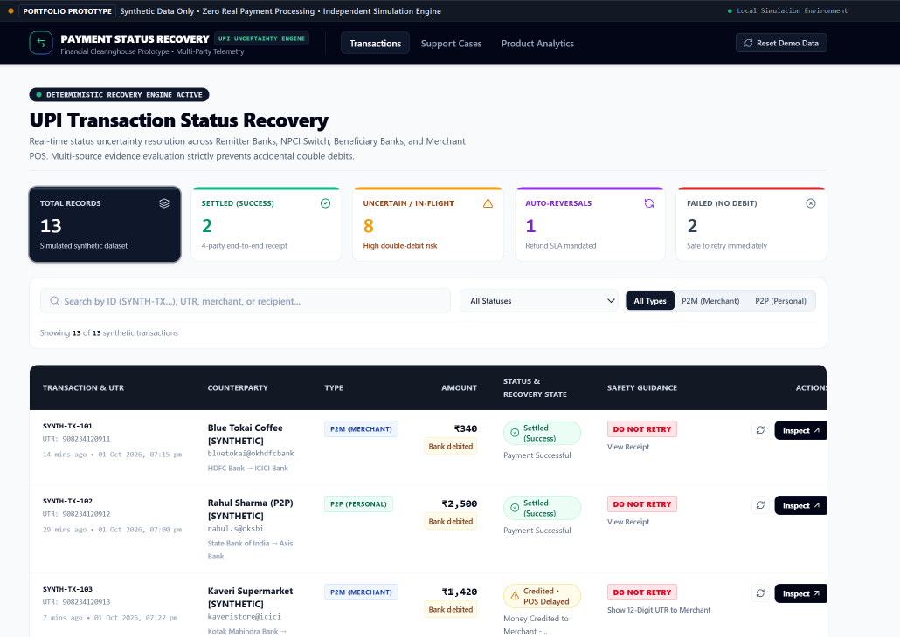
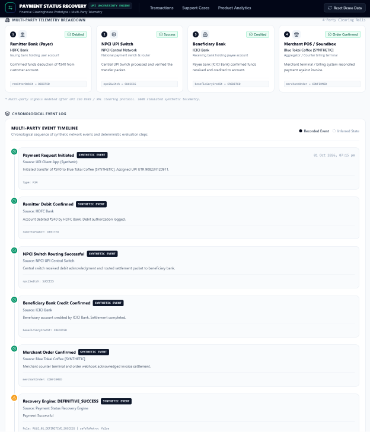
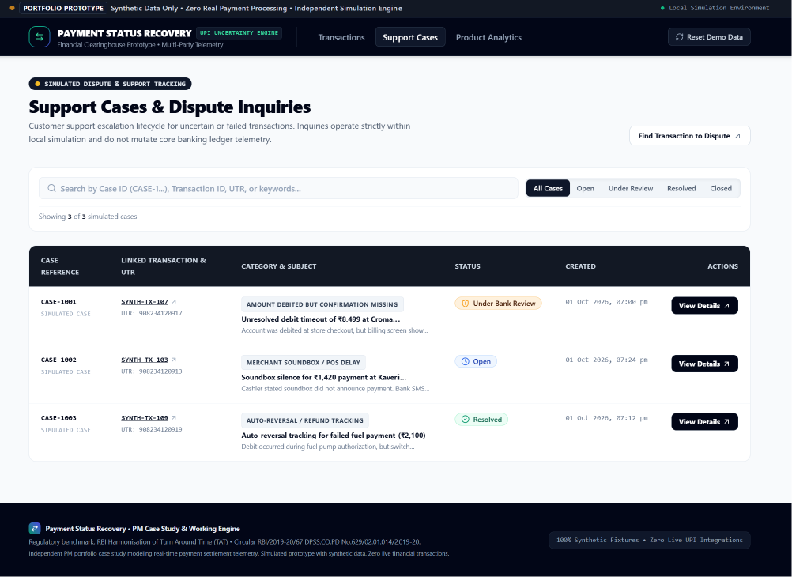
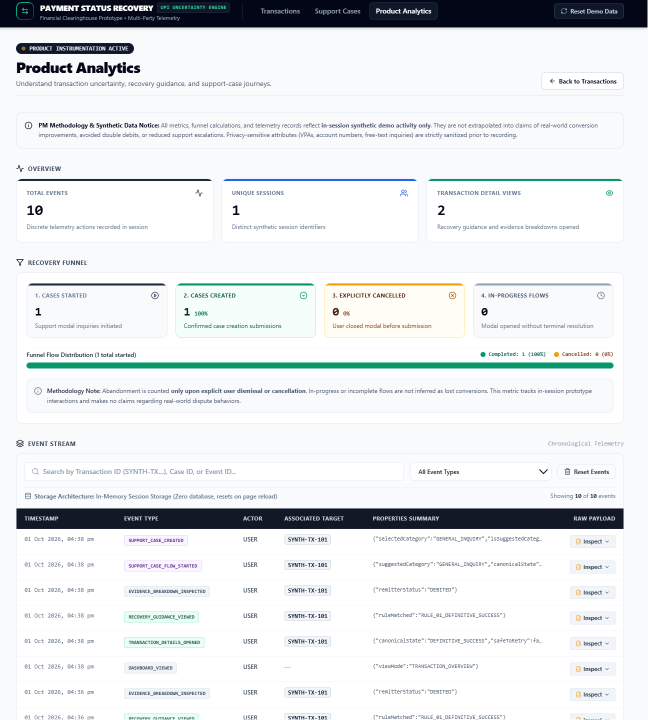

# Payment Status Recovery — UPI Transaction Uncertainty Engine

[](https://nextjs.org/)
[](https://www.typescriptlang.org/)
[](https://tailwindcss.com/)
[](https://vitest.dev/)
[](https://github.com/Saksham3124/payment-status-recovery)

**A Product Management case study and interactive prototype for handling uncertain UPI payment outcomes, preventing unsafe retries, and guiding users toward the next appropriate action.**

[View Repository](https://github.com/Saksham3124/payment-status-recovery) · [Report an Issue](https://github.com/Saksham3124/payment-status-recovery/issues)

> **Demo disclaimer:** This project uses synthetic transaction data and simulated banking signals. It is not connected to UPI, NPCI, banks, or live payment infrastructure.

---

## Table of Contents

* [Overview](#overview)
* [The Problem](#the-problem)
* [Product Approach](#product-approach)
* [Product Screenshots](#product-screenshots)
* [How the Recovery Engine Works](#how-the-recovery-engine-works)
* [System Architecture](#system-architecture)
* [Product Analytics](#product-analytics)
* [Support Case Management](#support-case-management)
* [Regulatory Context](#regulatory-context)
* [Tech Stack](#tech-stack)
* [Testing and Safety](#testing-and-safety)
* [Getting Started](#getting-started)
* [Limitations and Scope](#limitations-and-scope)
* [Potential Next Steps](#potential-next-steps)
* [Author](#author)

---

## Overview

Payment Status Recovery explores a common problem in real-time payment experiences: a transaction can appear unresolved even when different participants have received different status signals.

A customer may see a debit in their bank account while the merchant sees a pending or failed payment. Without a clear explanation of what is known and what remains uncertain, the customer may retry prematurely or contact support without sufficient context.

This prototype models a safer recovery experience through:

* A deterministic, table-driven transaction recovery engine.
* Simulated evidence from multiple payment participants.
* Explicit retry-safety decisions.
* Contextual recovery guidance and transaction timelines.
* A support-case lifecycle with validated status transitions.
* Session-level product analytics and privacy-conscious event instrumentation.

**Product objective:** Help users understand an uncertain payment state and identify an appropriate next step without encouraging an unsafe retry.

## The Problem

### The “Debited but Pending” dilemma

Consider a customer paying a merchant through UPI:

1. The customer's bank reports that the account has been debited.
2. The merchant's application still shows a pending or failed transaction.
3. The customer cannot tell whether the payment succeeded.
4. The customer may attempt the payment again.
5. If the original payment subsequently completes, the customer may face a duplicate payment or a more complicated reconciliation process.

The underlying challenge is not simply displaying a transaction status. It is determining what the available evidence supports and communicating uncertainty responsibly.

### Product questions

This case study explores four questions:

* How should the interface communicate conflicting payment signals?
* Under what conditions, if any, should a retry be permitted?
* What information should be shown before a user contacts support?
* How can product teams measure recovery journeys without treating incomplete flows as failed conversions?

---

## Product Approach

The prototype is organized around four capabilities.

| Capability            | Product purpose                                                                                      |
| --------------------- | ---------------------------------------------------------------------------------------------------- |
| Transaction recovery  | Consolidate simulated payment signals into a canonical status and recommended action.                |
| Evidence transparency | Explain what each participant reports and where uncertainty remains.                                 |
| Support workflows     | Allow users to create and track support cases linked to synthetic transactions.                      |
| Product analytics     | Inspect session events and support-case funnel activity without logging configured sensitive fields. |

### Core design principle

**Uncertainty should not be presented as proof of failure.**

When evidence is missing, delayed, malformed, or contradictory, the engine uses a conservative safe-hold outcome rather than authorizing a retry.

This is a prototype-level safety policy, not a claim that the application can independently establish the actual state of a live bank transaction.

---

## Product Screenshots

Replace these image paths with actual screenshots captured from the running application. Store the images in `docs/screenshots/`.

### 1. Transactions Dashboard

The transaction overview, status indicators, filters, and synthetic ledger.



### 2. Transaction Recovery and Evidence

The multi-party evidence breakdown, canonical recovery state, and recommended next action.



### 3. Support Case Management

The support-case listing, case status, and case activity history.



### 4. Product Analytics

Session-level event telemetry, recovery funnel metrics, and event inspection.



*All screenshots should use synthetic demo records. No real payment information should be included.*

---

## How the Recovery Engine Works

The recovery engine is implemented in pure TypeScript and separated from UI rendering.

It evaluates simulated signals from four participants:

| Participant      | Example evidence                               |
| ---------------- | ---------------------------------------------- |
| Remitter bank    | Debited, not debited, or debit unknown         |
| NPCI switch      | Success, failure, pending, or unreachable      |
| Beneficiary bank | Credited, failed, pending, or unknown          |
| Merchant POS     | Confirmed, pending, unknown, or not applicable |

These signals are reconciled into a canonical recovery state and corresponding guidance.

### Canonical recovery states

The following table summarizes the states modeled by the project.

| State                         | Retry permitted?            | Guidance                                                               |
| ----------------------------- | --------------------------- | ---------------------------------------------------------------------- |
| `DEFINITIVE_SUCCESS`          | No                          | Treat the transaction as completed.                                    |
| `CREDITED_MERCHANT_SYNC_LAG`  | No                          | Do not retry while merchant confirmation is delayed.                   |
| `IN_FLIGHT_SWITCH_ACCEPTED`   | No                          | Wait for the accepted transaction to resolve.                          |
| `IN_FLIGHT_REMITTER_DEBITED`  | No                          | Do not retry while the debit is confirmed and resolution is pending.   |
| `UNRESOLVED_DEBIT_TIMEOUT`    | No                          | Keep the transaction on hold and follow the recovery guidance.         |
| `AUTO_REVERSAL_IN_PROGRESS`   | No                          | Monitor the reversal process.                                          |
| `DEFINITIVE_FAILURE_NO_DEBIT` | Yes, under the modeled rule | Retry is permitted only with the required definitive failure evidence. |
| `ANOMALOUS_CONTRADICTION`     | No                          | Hold the transaction because the signals conflict.                     |
| `INDETERMINATE_SAFEGUARD`     | No                          | Preserve a safe hold when evidence is incomplete or invalid.           |

### Retry-safety invariant

The engine follows a strict rule: **a retry is allowed only when all required evidence supports definitive failure and confirms that no debit occurred.**

The modeled retry authorization requires:

* `remitterDebit === 'NOT_DEBITED'`
* `npciSwitch === 'FAILED'`
* `beneficiaryCredit === 'NOT_CREDITED'`

A switch timeout alone does not establish definitive failure. A confirmed debit, unknown debit status, missing evidence, or contradictory signals must not authorize a retry.

The rules are implemented and tested independently of the dashboard, support-case state, and analytics state.

---

## System Architecture

The application uses a layered architecture that separates deterministic recovery logic, synthetic data, state management, and presentation.

```text
src/
├── engine/
│   ├── rules-table.ts
│   ├── recovery-engine.ts
│   ├── types.ts
│   └── regulatory-framework.ts
│
├── mock/
│   ├── synthetic-transactions.ts
│   └── synthetic-support-cases.ts
│
├── context/
│   ├── TransactionContext.tsx
│   ├── SupportContext.tsx
│   └── AnalyticsContext.tsx
│
├── support/
│   ├── types.ts
│   ├── case-transitions.ts
│   └── category-suggestions.ts
│
├── analytics/
│   ├── types.ts
│   └── tracker.ts
│
├── components/
│   ├── common/
│   ├── transactions/
│   ├── guidance/
│   ├── support/
│   └── analytics/
│
└── app/
    ├── page.tsx
    ├── tx/[id]/page.tsx
    ├── support/page.tsx
    ├── support/[id]/page.tsx
    └── analytics/page.tsx
```

### Architecture responsibilities

* **Engine:** Evaluates evidence and produces recovery decisions.
* **Mock data:** Supplies reproducible synthetic transactions and support cases.
* **Context providers:** Manage in-memory transaction, support, and analytics state.
* **Support domain:** Validates case lifecycle transitions.
* **Analytics domain:** Defines versioned events, sanitization, and metric calculations.
* **UI components:** Present transaction evidence, guidance, support workflows, and analytics.
* **App Router:** Provides the dashboard and detail pages.

### Application routes

| Route           | Purpose                                         |
| --------------- | ----------------------------------------------- |
| `/`             | Transaction dashboard                           |
| `/tx/[id]`      | Transaction details and evidence reconciliation |
| `/support`      | Support-case listing                            |
| `/support/[id]` | Support-case details and activity history       |
| `/analytics`    | Product analytics and event stream              |

---

## Product Analytics

The analytics dashboard provides visibility into how a user interacts with the prototype.

### Instrumented interactions

The event model includes events such as:

* `DASHBOARD_VIEWED`
* `FILTER_APPLIED`
* `TRANSACTION_DETAILS_OPENED`
* `RECOVERY_GUIDANCE_VIEWED`
* `EVIDENCE_BREAKDOWN_INSPECTED`
* `SUPPORT_CASE_FLOW_STARTED`
* `SUPPORT_CASE_CREATED`
* `SUPPORT_CASE_CANCELLED`
* `SUPPORT_CASE_STATUS_CHANGED`
* `TELEMETRY_POLL_TRIGGERED`
* `TELEMETRY_POLL_COMPLETED`
* `DEMO_DATA_RESET`

The event stream and associated metrics are designed for inspecting synthetic demo sessions, not measuring real customer behavior.

### Recovery funnel methodology

The funnel distinguishes completed, explicitly cancelled, and unfinished flows.

* **Started:** Support-case creation flows initiated.
* **Completed:** Support cases created from the tracked flow.
* **Explicitly cancelled:** Flows explicitly cancelled by the user.
* **In progress:** Started flows without a recorded terminal outcome.

A flow is not automatically counted as abandoned merely because no support case exists. Rates are unavailable when the denominator is zero.

### Privacy-conscious instrumentation

The analytics tracker sanitizes configured sensitive fields before recording event payloads. It is designed to avoid storing raw VPAs, credentials, or free-text content in the event stream.

This protection is scoped to the prototype's configured event schema and sanitizer. It should not be interpreted as a comprehensive production privacy or security certification.

---

## Support Case Management

The support workflow models a basic case lifecycle linked to a synthetic transaction.

```text
OPEN
  ↓
UNDER_REVIEW
  ↓
RESOLVED
  ↓
CLOSED
```

The lifecycle validator restricts transitions to the modeled valid paths.

The support workflow provides:

* Case creation linked to a transaction.
* Suggested issue categories based on transaction context.
* Status tracking and activity history.
* Validation of case lifecycle transitions.
* A coordinated demo reset for transaction, support, and analytics state.

A support-case status change does not independently prove that a payment succeeded or failed. It also does not alter the transaction engine's retry-safety decision.

---

## Regulatory Context

The prototype references the Reserve Bank of India's circular on harmonisation of turnaround time and customer compensation for failed transactions:

**Circular:** `RBI/2019-20/67 DPSS.CO.PD No.629/02.01.014/2019-20`

The project distinguishes the regulatory framework from product-specific UX decisions.

* Applicable turnaround-time and compensation requirements depend on the transaction category and the conditions defined by the relevant RBI directions.
* The prototype models separate P2P/funds-transfer and merchant-payment timelines.
* The simulated 15-minute resolution cooldown is a product UX threshold, not an RBI-mandated waiting period.
* The engine does not connect to bank systems or verify compliance with actual payment-network requirements.

For implementation or production use, consult the official circular and any subsequent amendments rather than treating the prototype's guidance as legal or regulatory advice.

---

## Tech Stack

| Area             | Technology                                            |
| ---------------- | ----------------------------------------------------- |
| Framework        | Next.js App Router                                    |
| Language         | TypeScript                                            |
| UI               | React                                                 |
| Styling          | Tailwind CSS                                          |
| Testing          | Vitest                                                |
| State management | React Context and in-memory state                     |
| Recovery logic   | Pure TypeScript rules engine                          |
| Analytics        | Custom event schema, tracker, and metric calculations |
| Data             | Synthetic fixtures                                    |

---

## Testing and Safety

The reported test suite contains **88 tests across 21 test files**. Rerun the tests on the current commit to verify the present repository state.

```bash
npm test
```

The test coverage includes:

* Retry-safety invariants.
* Timeout and contradictory-evidence handling.
* Malformed telemetry inputs.
* Recovery-state transitions.
* Evidence breakdown and timeline ordering.
* Support-case lifecycle validation.
* Analytics schema and metric calculations.
* Reset behavior across transaction, support, and analytics state.

Run the production build before deploying:

```bash
npm run build
```

The passing test suite demonstrates the behavior of the tested synthetic scenarios. It does not establish production readiness for real payment processing.

---

## Getting Started

### Prerequisites

* Node.js 18.18+ or a compatible supported version.
* npm 9+.

### Installation

Clone the repository:

```bash
git clone https://github.com/Saksham3124/payment-status-recovery.git
cd payment-status-recovery
```

Install dependencies:

```bash
npm install
```

Start the development server:

```bash
npm run dev
```

Open http://localhost:3000.

### Production build

```bash
npm run build
npm start
```

The project uses synthetic, in-memory data and does not require live banking credentials for its current demo functionality.

---

## Limitations and Scope

This project is a product case study and technical prototype.

* All transactions and payment-participant signals are synthetic.
* There is no live UPI, NPCI, bank, or merchant-gateway integration.
* Transaction, support, and analytics state is held in memory and is not a persistent backend.
* Reloading the application restores the seed demo data.
* The recovery engine evaluates supplied signals; it cannot independently verify a real account debit or payment settlement.
* The analytics funnel describes instrumented prototype interactions, not validated customer conversion.
* The regulatory references provide context and should be checked against current official directions before any real-world implementation.

These limitations are intentional for the current portfolio scope.

---

## Potential Next Steps

Potential extensions, subject to validation and available infrastructure:

* User research on payment uncertainty and recovery comprehension.
* Usability testing of the recovery guidance and safe-hold states.
* Persistent storage and authenticated support workflows.
* Contract-defined integrations with authorized payment-status providers.
* Accessibility and responsive-interface audits.
* Expanded analytics with clearly defined measurement plans.
* Additional automated browser-level end-to-end tests.

These are possible future directions, not features currently claimed as implemented.

---

## Author

**Kumar Saksham**

Product Management Portfolio Case Study

* **GitHub:** [@Saksham3124](https://github.com/Saksham3124)
* **Repository:** [Payment Status Recovery](https://github.com/Saksham3124/payment-status-recovery)
* **Portfolio:** [kumarsaksham.vercel.app](https://kumarsaksham.vercel.app/)

---

*Payment Status Recovery is an independent portfolio project. It is not affiliated with or endorsed by the Reserve Bank of India, NPCI, any bank, or Mastercard.*
